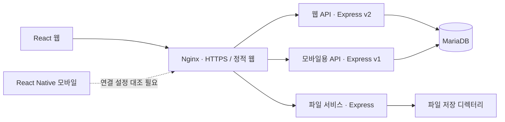

# FC Smart Platform

**가맹본부·매장·슈퍼바이저의 관리 업무를 연결한 웹·모바일 플랫폼**

FC Smart Platform은 KPC의 프랜차이즈·소상공인 매장관리 업무를 지원한 프로젝트입니다. 회원과 매장의 소속 관계, 현장 점검, 매출·비용 기록, 수익 분석, 상담·소통과 일정을 하나의 서비스로 연결했습니다. 저는 소규모 팀에서 기술 스택 선정과 데이터베이스·API 설계를 맡고, Node.js/Express 백엔드 대부분과 React 웹의 초기 구조 및 주요 기능을 개발했습니다.

## 프로젝트 한눈에 보기

| 구분 | 내용 |
| --- | --- |
| 기간 | **2019.12-2020.10** |
| 팀 | 디자이너 1명, 개발자 2명 — 본인 포함 |
| 사용 주체 | 운영자, 가맹본부, 슈퍼바이저, 매장 사용자 |
| 제공 형태 | React 웹, React Native 모바일 앱, Node.js/Express API |
| 주요 담당 | 기술 선택, DB·API 설계, 백엔드 대부분, React 웹 초기 구조와 주요 개발 |

기간·팀 구성·개인 기여는 당시 참여 경험을 기준으로 정리했습니다. 아래 구현 설명은 보관된 소스와 설정에서 확인한 범위이며, 현재 서비스의 운영 상태나 성능을 의미하지 않습니다.

## 제가 맡은 일

- **프로젝트 전반의 개발을 주도했습니다.** 주요 기술 스택을 선택하고, 웹·모바일·서버를 JavaScript 중심으로 개발하는 접근을 정했습니다. 공식 직책을 뜻하는 표현은 아닙니다.
- **데이터베이스와 API를 설계하고 백엔드 대부분을 구현했습니다.** 고객 요구를 회원·소속·매장·점검·수익 데이터의 관계와 업무별 API로 구체화했으며, 인증·권한 설계와 구현에 참여했습니다.
- **React 웹의 초기 구조와 주요 기능을 개발했습니다.** 페이지 구성과 라우팅을 포함해 웹·백엔드 사이의 업무 흐름을 연결했습니다.
- **고객 요구와 계산 기준을 애플리케이션 로직으로 옮겼습니다.** KPC에서 제공한 계산 기준을 데이터 항목, API, 집계·분석 및 결과 표시 흐름에 반영했습니다. 계산 기준의 제공 주체는 참여 경험에 따른 설명입니다.
- **React Native 개발에는 협업자로 참여했습니다.** 모바일 기능 구현의 더 큰 비중은 다른 개발자가 담당했습니다. 아래 모바일 기능은 제품의 범위이지, 제가 단독 구현했다는 의미가 아닙니다.

## 어떤 업무를 지원했나

| 업무 | 소스에서 확인한 기능 |
| --- | --- |
| 조직·회원·매장 관리 | 가맹본부·슈퍼바이저·매장 관계, 회원 등록·조회·수정, 담당 매장 관리 |
| 현장 점검 | QSC 품질·서비스·위생 점검, 법규 관련 체크리스트, 점주 상담, 사진·서명이 연결된 점검 결과 |
| 수익 관리 | 매장별 매출·비용 입력 화면, 항목·기준 비율 관리, 회차별 결과와 손익·비용 분석 |
| 소통·운영 | 공지·소통·VOC 게시판, 댓글, 일정, 팝업, 회원·접속 통계 |
| 결과 활용 | 웹·모바일의 표·차트, 회원·통계 목록 CSV, 점검 보고서 Excel 파일 생성 |

입력 권한은 사용자 유형과 API에 따라 다릅니다. 보관된 모바일 API에는 점주 유형의 수익 저장을 제한하는 코드가 있어, 모든 점주가 직접 입력·저장할 수 있었다고 일반화하지 않았습니다.

## 시스템 구성

Docker Compose에는 Nginx, 웹 API, 모바일용 API, 파일 서비스, MariaDB가 각각 정의되어 있습니다. 도식은 **서버 설정 기준**입니다. 모바일 보관본의 API 주소는 서버 라우팅과 일치하지 않으므로, 이 자료를 그대로 실행 가능한 배포본으로 제시하지 않습니다. [구성과 확인 범위](docs/architecture.md)

## 설계·구현에서 보여줄 수 있는 것

### 고객 요구를 데이터와 업무 흐름으로 연결

가맹본부별 점검·수익 항목과 매장별 수행 결과를 구분하고, 회원의 소속 관계를 조회 범위에 반영했습니다. 요구사항을 화면 목록으로만 정리하지 않고 데이터 관계, 입력 단위, 결과 조회까지 연결한 경험입니다.

### 매출 입력을 분석 결과로 이어지게 구현

수익 항목과 기준 비율을 관리하고, 매장별 입력값을 리포트에 연결했습니다. 백엔드는 항목 저장과 매출·비용 합계를 처리하고, 웹·모바일은 그 결과를 바탕으로 손익, 기준 대비 비용, 이전 회차 비교를 표시합니다. 모든 계산을 서버 한곳에서 수행하는 구조는 아닙니다.

### 사용자 유형과 소속을 고려한 API

Passport Local·bcrypt 기반 로그인, JWT 발급·Bearer 검증, 개별 라우트의 사용자 유형·소속 확인을 구현한 코드가 있습니다. 이를 인증과 업무별 접근 제어 경험으로 설명하며, 모든 API의 권한 검증이 완전했다는 보안 보증으로 확대하지 않습니다.

### 입력·검토·보고서까지 이어지는 제품 개발

모바일의 점검 기록·사진·서명, 백엔드의 리포트 저장, 웹의 결과 검토와 Excel 출력이 연결됩니다. 이 전체 제품 흐름 안에서 저는 DB·API 및 웹·백엔드 개발을 중심으로 기여했습니다.

## 당시 기술 스택

| 영역 | 확인된 주요 기술 |
| --- | --- |
| 웹 | JavaScript, React 16, React Router 5, MobX, Material UI, ApexCharts, react-csv, ExcelJS |
| 모바일 | React Native 0.62 계열, React Navigation 5, MobX, NativeBase, 네이티브 차트·지도·이미지·서명 연동 |
| 백엔드 | Node.js 12 계열, Express 4, TypeDI, Passport, JWT, bcrypt, MariaDB 드라이버 |
| 데이터·구성 | MariaDB 10.4 계열, Docker, Docker Compose, Nginx |
| 외부 연동 | Firebase Messaging, 메일, Naver 지도·좌표 변환 API |

2019–2020년 프로젝트의 기술 기록이며 현재 신규 개발을 위한 버전 권장 목록이 아닙니다.

## 더 자세히 보기

[시스템 구성과 배포 기록](docs/architecture.md) · [백엔드·데이터와 수익 처리 흐름](docs/backend-and-data.md) · [제품 범위와 개인 기여](docs/product-and-contribution.md)

원본 ERD와 고객 데이터가 포함될 수 있는 화면 대신, 위 시스템 구성도와 [식별정보 없는 도메인 개념도](docs/backend-and-data.md#도메인-관계)를 제공합니다.

> 원본 상용 소스 코드는 공개 배포하지 않습니다. 이 디렉터리는 역사적 소스의 구조와 기능을 검토해 작성한 포트폴리오 문서이며, 운영 데이터·접속 정보·인증서·개별 고객의 계산 기준값은 포함하지 않습니다.
