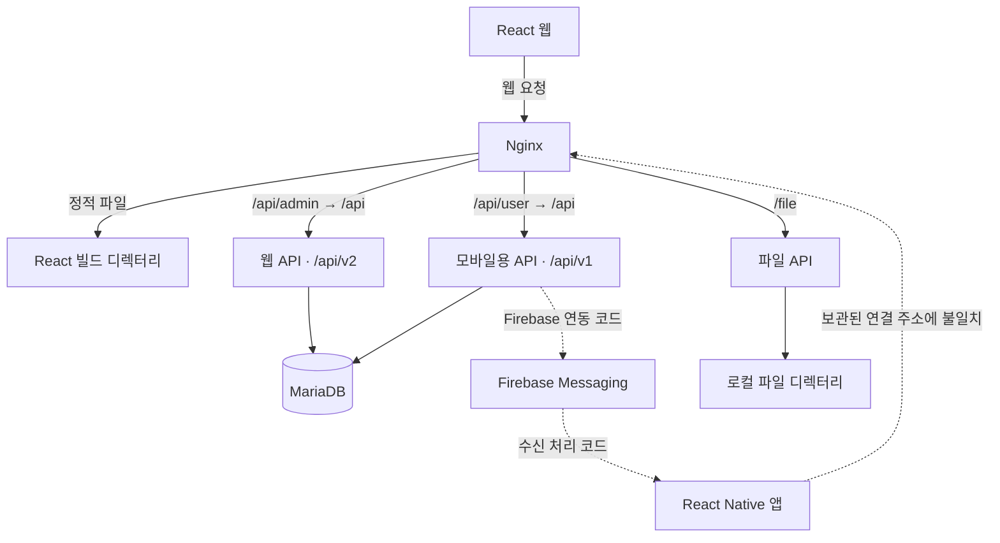

# 시스템 구성과 배포 기록

[프로젝트 소개로 돌아가기](../README.md)

이 문서는 보관된 소스와 설정에서 확인한 프로세스 경계와 통신 구조를 정리합니다. 실제 운영 환경을 다시 접속하거나 서비스를 실행한 결과는 아닙니다. 특히 모바일 연결 주소와 일부 설정에는 보관본 간 차이가 있습니다.

## 클라이언트와 API의 경계

웹은 React의 페이지·공통 컴포넌트, 라우팅, MobX 상태, Axios API 호출 모듈로 구성되어 있습니다. 로그인·계정 찾기 등의 진입 화면과 관리 화면이 구분되고, 관리 화면 아래에 회원·점검·수익·게시판·통계 페이지가 연결됩니다.

모바일은 React Native와 React Navigation의 Drawer·Stack·Tab 구조를 사용합니다. 매장 선택 이후 점검·수익·소통 화면으로 이동하고, 공통 API 모듈에서 토큰을 읽어 요청합니다. 네이티브 저장소, 이미지 선택, 서명, 지도, 차트, 푸시 수신 코드가 확인됩니다.

백엔드는 하나의 실행 파일 안에 모든 API를 넣은 형태가 아니라, 웹용·모바일용·파일 처리용 Express 애플리케이션으로 나뉘어 있습니다. 웹용과 모바일용은 동일한 MariaDB 서비스에 연결하는 구성입니다. 두 API의 서비스·모델 코드에는 중복과 차이가 함께 있으며, 하나의 공통 코드 패키지를 공유한다고 설명하지 않습니다.

| 서버 구성 | 역할 |
| --- | --- |
| Nginx | 정적 웹 파일 제공, HTTPS 설정, API·파일 요청 전달 |
| 웹용 API | 서버 내부 `/api/v2`에 업무 라우트 등록 |
| 모바일용 API | 서버 내부 `/api/v1`에 업무 라우트 등록 |
| 파일 서비스 | `/file/v1` 업로드·삭제, `/file` 정적 파일 제공 |
| MariaDB | 회원·소속·매장·점검·수익·게시판·운영 데이터 저장 |

## 서버 설정 기준 통신 구조

실선은 서버 설정과 호출 구조에서 확인한 연결입니다. 모바일 진입 연결과 외부 푸시 연동의 점선은 실행 성공을 검증한 경로가 아니라, 설정 대조 또는 외부 환경 확인이 필요한 부분입니다.

### 모바일 주소가 일치하지 않는 부분

웹 클라이언트는 `/api/admin/v2`를 사용하며, Nginx를 거쳐 웹 서버의 `/api/v2`에 대응합니다. 반면 모바일 클라이언트의 보관된 기본 경로는 **`/api/admin/v1`**입니다. 제공된 Nginx 설정에서 이 경로는 웹 서버로 전달되지만, 해당 서버에는 v2 라우트만 등록되어 있습니다. 모바일용 서버의 v1 등록 구조에 대응하는 외부 경로는 **`/api/user/v1`**입니다.

따라서 “이 세 보관본을 그대로 배포하면 모바일까지 동작한다”고 주장할 수 없습니다. 문서에서는 서버의 모바일용 기능과 앱의 기능 대응을 설명하되, 당시 최종 배포 주소나 별도 라우팅 설정은 미확인으로 남겼습니다.

## API 내부 구조

업무별 라우트가 요청을 받고, 서비스가 데이터 접근 모듈을 호출하는 구조가 중심입니다. TypeDI로 서비스를 가져오는 코드와 MariaDB 드라이버를 직접 사용하는 모델이 있습니다. 다만 통계·일정 등 일부 라우트는 모델을 바로 호출하므로, 전 구간에 엄격히 동일한 계층 구조가 적용되었다고 설명하지 않습니다.

웹 API의 v2와 모바일용 API의 v1은 보관본에서 확인한 구분입니다. 이를 일반적인 API 수명주기 정책이나 완성된 하위 호환성 전략으로 확대하지 않았습니다.

## 파일 처리

파일 서비스는 Multer로 원본·썸네일, 공지 첨부, 팝업 이미지를 받습니다. 저장 디렉터리와 파일 이름 변경·삭제 코드가 있으며, 클라이언트는 업무 API에서 파일 메타데이터를 다루고 별도 파일 API로 실제 파일을 전송합니다.

원본과 썸네일을 각각 받는 구조이지, 서버가 모든 썸네일을 자동 생성한다는 증거는 아닙니다. 저장소는 설정상 로컬 디렉터리이며, 객체 스토리지·CDN 구성을 의미하지 않습니다. 공개 문서에는 실제 파일, 경로상의 운영 호스트, 인증서 내용을 포함하지 않습니다.

## 외부 연동과 정기 작업

Firebase Admin의 토픽 구독·메시지 전송 코드와 모바일의 메시지 수신 처리를 확인했습니다. 모바일용 API에는 Firebase 초기화가 있지만 웹용 프로세스에서는 대응 초기화를 확인하지 못했으므로, 모든 프로세스의 알림 전송이 정상 동작했다고 단정하지 않습니다.

Nodemailer 기반 메일 처리와 `node-schedule` 기반 일정 알림·계약 종료 알림·계정 정리 작업도 있습니다. 정기 작업은 웹용 애플리케이션에서 모듈을 읽을 때 등록됩니다. 실행 로그나 당시 외부 설정은 제공되지 않았으므로 실제 발송 성공률·운영 주기 준수는 확인하지 않았습니다.

지도는 웹·모바일의 Naver 지도 표시와 좌표 변환 API 사용 코드로 확인했습니다. **지도 API 사용만으로 운영 서버의 호스팅 사업자를 Naver Cloud Platform으로 확정하지는 않았습니다.**

## Docker·Nginx에서 확인한 범위

Compose에는 위 다섯 서비스, 내부 네트워크, 데이터·소스·정적 웹 파일의 볼륨 연결이 정의되어 있습니다. Node 이미지와 MariaDB·Nginx 이미지 버전, TLS 인증서 파일 참조, HTTP에서 HTTPS로의 전환, SPA 경로의 기본 문서 처리가 확인됩니다. 비밀값과 실제 운영 주소는 문서에서 제외했습니다.

보관된 Compose는 개발 모드와 개발용 시작 명령을 사용합니다. 따라서 이것을 검증된 운영 배포 자동화, 무중단 배포, 고가용성 구성으로 소개하지 않습니다. 설정에 남아 있는 DB 대상 HTTP 프록시 항목도 정상적인 DB 접속 경로로 도식화하지 않았습니다.

## 재구성의 한계

모바일 기본 주소의 불일치 외에도 SQL 스키마와 애플리케이션이 사용하는 일부 컬럼이 다릅니다. 예를 들어 접속 통계 코드는 SQL 보관본에 없는 추가 필드를 참조합니다. 배포 환경·마이그레이션·실행 결과 없이 마지막 운영 상태까지 복원했다고 말할 수는 없습니다.

이 포트폴리오가 보여주는 것은 **당시 개발한 서비스의 구성과 구현 경험**입니다. 소스·자격 증명을 공개하거나 오래된 의존성을 설치해 현재 운영 가능한 제품으로 재배포하려는 문서는 아닙니다.
