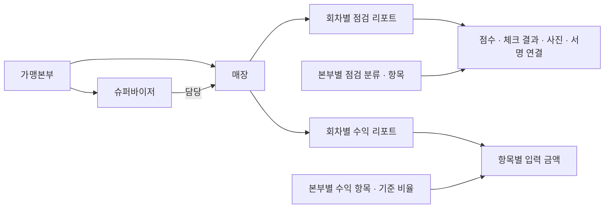

# 백엔드·데이터와 수익 처리 흐름

[프로젝트 소개로 돌아가기](../README.md)

구현 설명은 보관된 라우트·서비스·SQL·클라이언트 코드의 정적 검토를 기준으로 합니다. 데이터베이스와 API 설계, 백엔드 대부분의 개발은 본인의 기여이며, 개별 파일의 저작자를 소스 존재만으로 판정한 것은 아닙니다.

## 업무별 API와 데이터 접근

API는 계정, 회원·소속, 점검, 수익, 게시판, 일정, 통계, 운영 기능으로 구분됩니다. 업무 라우트에서 사용자 정보를 확인하고 서비스·모델을 통해 MariaDB에 접근합니다. 모델은 ORM 대신 SQL과 값 배열을 구성해 드라이버에 전달합니다. 일부 라우트는 모델을 직접 호출합니다.

공통 계정과 유형별 상세 정보를 함께 등록하는 처리에는 트랜잭션이 사용됩니다. 여러 점검·수익 항목을 저장하는 배치 처리에도 트랜잭션 코드가 있습니다. 다만 리포트 항목 저장과 리포트 합계 갱신이 항상 하나의 트랜잭션으로 묶이는 것은 아니므로, 모든 업무 단위의 원자성을 보장했다고 표현하지 않습니다.

## 인증과 사용자 유형

로그인은 Passport Local이 계정을 조회하고 bcrypt로 비밀번호를 비교하는 방식입니다. 가입·비밀번호 변경 코드에서도 bcrypt 해시가 사용됩니다. 로그인 후에는 사용자 식별자와 유형 등을 담은 JWT를 발급하고, 업무 라우트의 공통 지점에서 Bearer 토큰을 검증합니다.

사용자 유형은 운영자, 가맹본부, 슈퍼바이저, 매장 사용자로 나뉩니다. 회원 조회 등의 라우트는 유형별 수준과 소속·담당 관계를 확인하며, 점검·수익 조회에서도 본부 또는 담당자에 따른 범위를 다룹니다. 이 검사가 개별 라우트에 분산되어 있으므로, 전체 API를 포괄하는 일관된 권한 정책이나 완성된 접근 제어 검증 결과를 의미하지는 않습니다.

검증은 이메일 형식, 일부 요청 종류·날짜 형식, 사용자·소속 확인 등으로 구현되어 있습니다. 통합된 스키마 검증 체계가 있었다고 주장하지 않습니다. 오류 처리 역시 라우트의 `try/catch`, 상태 응답, Express의 기본 오류 처리 등 여러 형태가 함께 존재합니다.

## 도메인 관계

아래는 실제 테이블 정의와 조회·저장 코드에서 관계를 추려 만든 **공개용 개념도**입니다. 원본 ERD 전체나 모든 물리적 외래 키를 재현한 것이 아니며, 실제 계정·연락처·매출 기록을 포함하지 않습니다.

| 데이터 영역 | 구현에서 확인한 구분 |
| --- | --- |
| 회원·소속 | 공통 계정, 유형별 상세 정보, 본부·담당자·매장 관계 |
| 점검 기준 | 본부별 분류, 개별 항목, 사용 여부 |
| 점검 결과 | 매장·회차별 리포트, 점수형·체크형 결과, 이미지·서명 연결 |
| 수익 기준 | 항목의 수입·비용 구분, 기준 비율, 사용 여부 |
| 수익 기록 | 리포트별 항목 금액, 매출·비용 합계, 총평·개선 방향 |
| 소통·운영 | 게시글·댓글·첨부, 일정, 팝업, 접속 기록 |

회원의 기본 계정과 유형별 정보를 구분하고, 점검·수익에서는 기준 항목과 수행 결과를 나누었습니다. 회차별 리포트에 여러 항목을 연결하는 구조로, 화면에서 입력한 값과 나중에 조회할 결과의 단위를 맞췄습니다.

SQL에는 기능별 권한 항목과 기준값 관련 테이블도 있지만, 테이블이 존재한다는 이유만으로 모든 기능이 실제 사용됐다고 분류하지 않았습니다. 원본 스키마와 코드 사이의 차이도 있어 전체 스키마의 최종 운영 버전을 확정하지는 않았습니다.

## 고객의 계산 기준을 서비스로 연결한 과정

**KPC가 계산 기준을 제공했고 팀이 이를 구현했다는 점은 본인의 참여 경험에 따른 설명**입니다. 보관본에는 그 원본 요구사항 문서나 공식 계산 명세가 없으므로, 아래 코드 흐름이 모든 공식 기준을 정확히 재현했다는 검증까지 의미하지는 않습니다. 개별 고객의 기준값이나 상세 수식은 공개하지 않습니다.

| 단계 | 확인된 구현 |
| --- | --- |
| 기준 정의 | 웹에서 본부별 수익 항목, 수입·비용 유형, 사용 여부, 기준 비율을 관리 |
| 입력 | 모바일에서 매장과 리포트 회차를 기준으로 항목별 금액을 입력하고 저장 API를 호출 |
| 저장·합산 | 백엔드에서 항목을 리포트에 연결해 저장하고, 수입·비용 유형별 합계를 리포트에 반영 |
| 조회 | API가 리포트와 항목별 값·기준 정보를 반환 |
| 분석·표시 | 웹·모바일이 손익, 기준 대비 비용, 이전 회차와의 차이를 표·차트로 구성하고 총평·개선 방향을 다룸 |

여기에서 중요한 것은 **계산의 책임이 서버와 클라이언트에 나뉜다**는 점입니다. 서버는 항목 저장과 합계 갱신을 수행하고, 기준 대비 금액·차이와 표시용 분석값의 일부는 웹·모바일에서 계산합니다. 독립적인 서버 계산 엔진이나 모든 단말이 하나의 계산 모듈을 공유한 구조로 소개하지 않습니다.

또한 코드의 `profit_money`라는 이름을 곧바로 순이익으로 번역하지 않았습니다. 저장 로직에서는 수입 유형의 합계에 사용되며, 화면에서 비용과 함께 손익을 구성합니다. 순이익을 별도 서버 필드로 완결 계산·저장한다고 단정하지 않습니다.

“전월”이라는 화면 문구와 달리, 일부 비교는 날짜상 전월이 아니라 **이전 리포트 회차**를 조회합니다. 문서에서는 이를 이전 회차 비교로 표현합니다. 기준 비율의 변경 이력이나 계산 규칙 버전 관리까지 구현되었다는 증거도 확인하지 못했습니다.

### 입력 권한의 보관본 차이

제품의 업무 맥락은 매장 매출을 입력하고 결과를 확인하는 것이지만, 제공된 모바일용 API에는 매장 사용자 유형의 수익 리포트 생성·수정을 거부하는 코드가 있습니다. 따라서 입력 화면의 존재와 모든 사용자 유형의 저장 권한을 동일시하지 않았습니다. 당시 최종 권한 설정과 요구 변경의 반영 시점은 별도 확인이 필요합니다.

## 현장 점검과 보고서

QSC는 품질·서비스·위생 항목을 점수로 기록하고, 법규 관련 점검과 점주 상담은 체크형 결과로 다룹니다. 리포트에는 항목별 결과, 총평, 이미지 및 서명 참조가 연결됩니다. 웹과 모바일에서 결과를 조회하며, 모바일의 사진·서명 입력과 웹의 보고서 구성이 확인됩니다. 법률 준수 여부를 자동으로 보증하는 시스템이라는 뜻은 아닙니다.

웹의 점검 결과 화면은 ExcelJS로 워크북을 만들고 내용·서명 이미지를 배치한 뒤 `.xlsx` 파일을 생성합니다. 회원·통계 목록에는 별도로 `react-csv` 기반 CSV 다운로드가 있습니다. 일부 버튼은 “엑셀다운”이라고 표시되지만, 파일 형식은 구현에 따라 구분했습니다. **수익 분석 화면 전체가 Excel 내보내기를 제공했다고 확대하지 않았습니다.**

## 통계·로그·정기 작업

웹 API에는 회원과 접속 기록을 기간·분류별로 조회·집계하는 코드가 있으며, 웹은 이를 차트와 표로 표시합니다. 반면 모바일용 통계 라우트의 일부는 실제 처리기가 없는 선언에 그쳐 웹과 동일한 통계 API를 제공한다고 설명하지 않습니다.

HTTP 요청의 Morgan 로그가 연결되어 있고 Winston의 회전 파일 설정도 존재합니다. 다만 확인한 애플리케이션에서는 Morgan과 Winston의 별도 연결 코드가 주석 처리되어 있어, 완성된 통합 감사 로그 체계라고 표현하지 않습니다.

일정·계약 알림 및 계정 정리 작업은 스케줄러 코드로 확인했습니다. 작업 성공 여부나 외부 메일·푸시 환경의 운영 상태는 검증하지 않았습니다. 소스에서 확인한 구현 경험과 운영 성과는 구분합니다.
